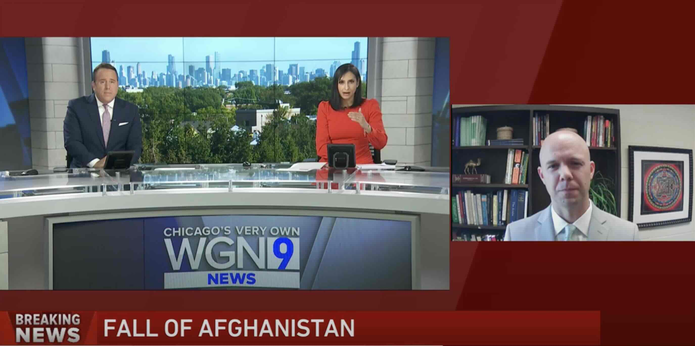

::: {layout-ncol=2}

I regularly speak with local television, radio, and print media to discuss breaking news related to international affairs and U.S. foreign policy. I have appeared on WGN-TV Chicago, FOX32 Chicago, NPR's "The 21st," and the Australian Broadcast Corporation's "Big Ideas," among others.

:::

### US-Iran Conflict
- [WIFR 23 Rockford: 3/2/2026](https://www.wifr.com/2026/03/03/illinois-congressman-political-expert-respond-us-military-action-targeting-iran/)
- [WTVO Rockford: 3/2/2026](https://www.mystateline.com/news/local-news/niu-professor-analyzes-u-s-iran-conflict-and-public-sentiment/)
- [WNIJ Northern Public Radio: 3/2/2026](https://www.northernpublicradio.org/wnij-news/2026-03-02/northern-illinois-university-professor-gives-context-to-trumps-iran-strikes)
- [WREX 13 Rockford: 3/1/2026](https://www.wrex.com/news/niu-professor-presidential-use-of-force-likely-to-spark-congressional-debate/article_2176c827-35d8-45bc-beab-6fcb8dc231fd.html)
- [WIFR 23 Rockford: 6/23/2025](https://www.youtube.com/watch?v=bhJzOxLHG2I)
- [WIFR 23 Rockford: 1/8/2020](https://www.wifr.com/content/news/LOCAL-PROFESSORS-WEIGH-IN-ON-MISSILE-STRIKE--566827601.html)

### US Intervantion in Venezuela
- [WREX 13 Rockford: 1/6/2026](https://mx.technolutions.net/ss/c/u001.cpQnkll3XXHbQrBNB1xm0GOLFHByLXJ8BShU5xO93SXesH6DFm4VRbgqzx8mp9bHhQ0M0tMpY0niXJMnwkU7GwQqzyzubf2qi0dLOPK0vrc6wjL71AmwsnsWU0E5S7kQg4TybEqOCc9eIPCom-PhXupX13g8vU9QG3uLS6EpwLsrws1YI5GAoSpY2kEUXE2LySkbSgm2YR9NIPmlmQqGWA/4nb/WLvCj7uIS9S3vgS5TPv0bA/h21/h001.k2BYIY1Koi4oHeZnAw6iDt1UgCsFuWrd_asp8JkOOFw)

### Russia-Ukraine War
- [WIFR 23 Rockford: 2/24/2023](https://www.wifr.com/2023/02/24/world-marks-one-year-since-russia-invaded-ukraine/)
- [FOX 32 Chicago: 4/21/2022](https://www.fox32chicago.com/video/1060344); [2/23/2022](https://www.fox32chicago.com/video/1038416); [2/16/2022](https://www.youtube.com/watch?v=h_ESpwI6_rc); [6/16/2021](https://www.fox32chicago.com/video/944837).
- [NPR, "The 21st": 2/28/2022](https://www.npr.org/podcasts/475680317/the-21st).
- [WNIJ Northern Public Radio: 2/24/2022](https://www.northernpublicradio.org/2022-02-24/dekalb-county-this-week-reaction-to-tensions-in-europe-stage-coach-players-to-hold-auditions)

### Fall of Afghanistan
- [WGN 9 Chicago: 8/16/2021](https://www.youtube.com/watch?v=IsijwhsA4Nk).
- [WTVO Rockford: 8/16/2021](https://www.mystateline.com/news/local-news/rockford-veteran-worries-for-afghan-allies-left-behind-as-taliban-overrun-the-country/)]
- [*The DeKalb Daily Chronicle*: 8/20/2021](https://www.shawlocal.com/daily-chronicle/news/local/2021/08/21/history-repeating-itself-local-veterans-residents-reflect-on-events-in-afghanistan/)

### Other

- [WNIJ Northern Public Radio: 8/28/2020](https://www.northernpublicradio.org/business/2020-08-28/tiktok-data-security-and-dueling-economies); [4/13/2017](https://www.northernpublicradio.org/post/scrutiny-mounts-travel-orders); [4/7/2017](https://www.northernpublicradio.org/post/niu-professor-trump-drew-line-chemical-weapons).
- [WCEV 1450 Chicago: 2/19/2019](https://soundcloud.com/radioislamusa/ep-6721-crisis-in-venezuela-02-19-2019); [5/4/2018](https://soundcloud.com/radioislamusa/ep-527-conflict-in-a-nuclear-world-with-ches-thurber-5318); [2/15/2018](https://www.radioislam.com/node/28279).
- [*Egypt Today*: 9/14/2017](https://www.egypttoday.com/Article/2/22724/Iraqi-Militias-The-Tangle-of-Flags)
- [*The Fletcher Security Review*: Feb. 2017](https://docs.wixstatic.com/ugd/c28a64_c8ed8f4140894077be782bda046b4f96.pdf)
- [Australian Broadcast Corporation, "Big Ideas": 2/18/2015](https://www.abc.net.au/radionational/programs/bigideas/revolutionary-movements/6035042).
